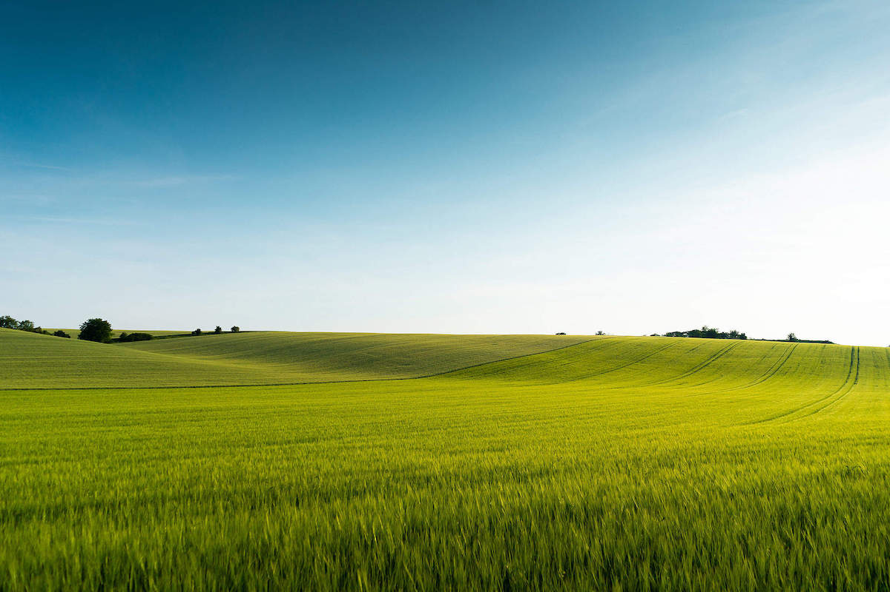
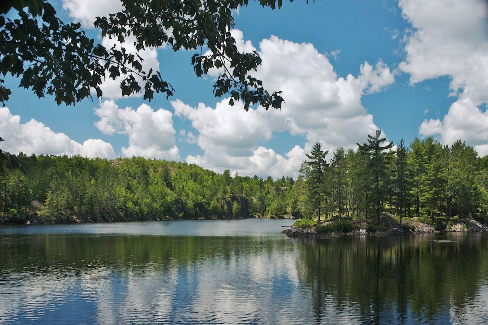
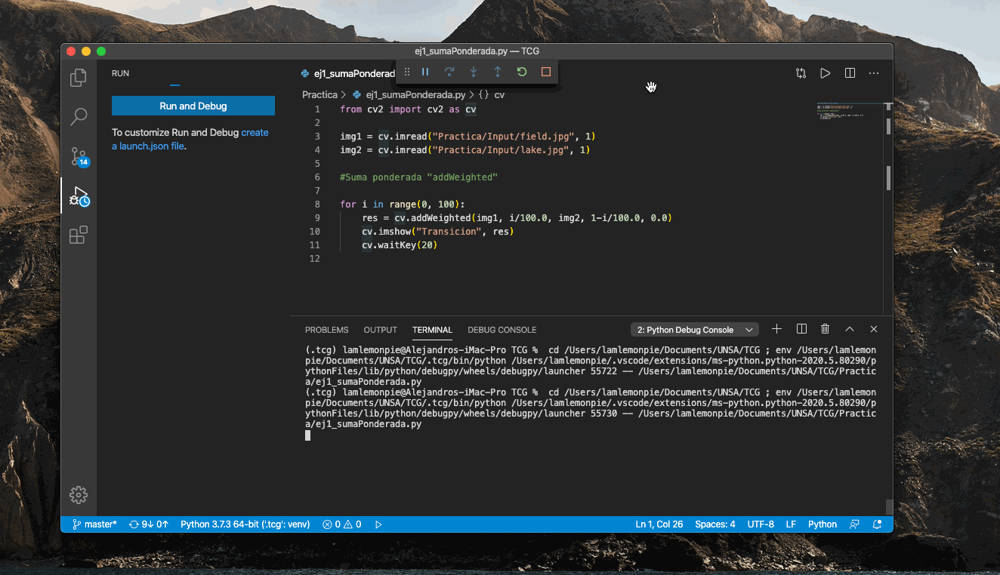
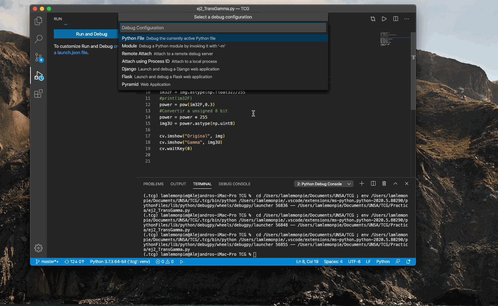
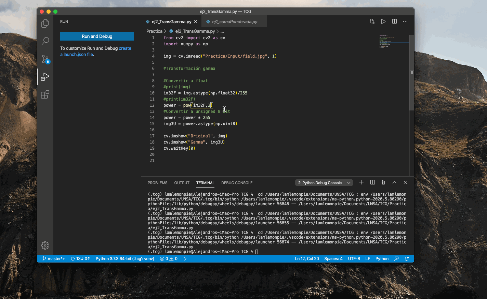
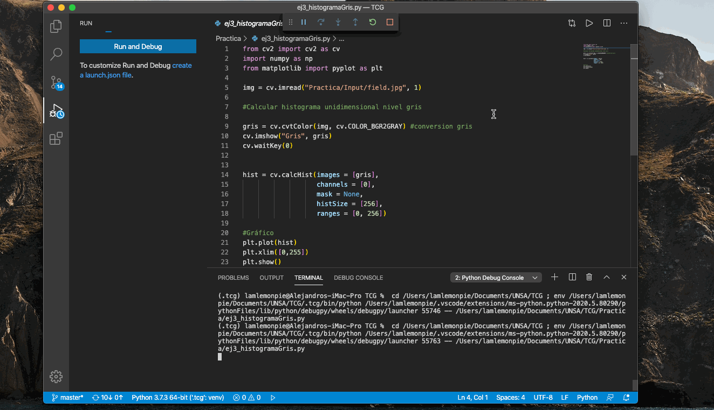

# PROCESAMIENTO GLOBAL EN OpenCV
## Estudiante
- Larraondo Lamchog, Alejandro Jesús

## Requerimientos
```terminal
$ apt install python
$ pip install numpy
$ pip install opencv-python
$ pip install matplotlib
```
## EJERCICIOS

### Ejercicio 1: Suma ponderada de dos imágenes.

- Entrada: Imagen field.jpg y Imagen lake.jpg




- Salida:




### Ejercicio 2: Realizar la Transformación Gamma de una imagen.


- Entrada: Imagen field.jpg


- Salida con gamma = 0.3:



- Salida con gamma = 2:



### Ejercicio 3: Calcular el histograma unidimensional del nivel de gris de una imagen “a.jpg” en color. El resultado se escribe en salida debug.

- Entrada: Imagen field.jpg


- Salida:




### Ejercicio 4: Calcular el histograma bidimensional de los canales (R,G) de una imagen “a.jpg” en color, con 64x64 celdas. El resultado se pinta en una imagen.

### Ejercicio 5: Aplicar una ecualización conjunta del histograma a una imagen “a.jpg” en color, usando calcHist y LUT.

- Entrada: Imagen lake.jpg


- Salida:

