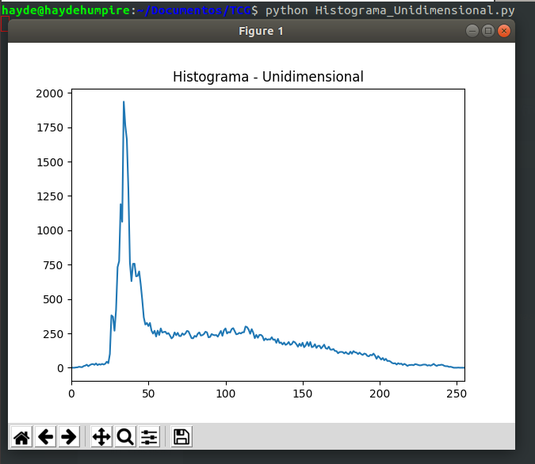

# PROCESAMIENTO GOBLAL EN OpenCV
## Estudiante
- Humpire Cutipa, Hayde Luzmila

## Requerimientos
```terminal
$ apt install python
$ pip install numpy
$ pip install opencv-python==4.1.2.30
```
## EJERCICIOS

### Ejercicio 1: Transición entre dos imágenes A y B (mismo tamaño y número de canales).

- Entrada: Imagen A y Imagen B


- Compilación:

```terminal
hayde@haydehumpire:~/Documentos/TCG$ python Ej2_TransicionDosImagenes.py
```

- Salida:


### Ejercicio 2: Transformación gamma

### Ejercicio 3: Histograma unidimensional del nivel de gris de una imagen “a.jpg” en color. 

- Entrada: 


- Compilación:

```terminal
hayde@haydehumpire:~/Documentos/TCG$ python Ej3_HistogramaUnidimensional.py
```

- Salida:





### Ejercicio 4: Histograma bidimensional de los canales (R,G) de una imagen “a.jpg” en color, con 64x64 celdas. 

### Ejercicio 5: Ecualización conjunta del histograma a una imagen “a.jpg” en color, usando calcHist y LUT.

- Entrada: 


- Compilación:

```terminal
hayde@haydehumpire:~/Documentos/TCG$ python python Ej5_Ecualizacion_Imagen.py 
```

- Salida:


