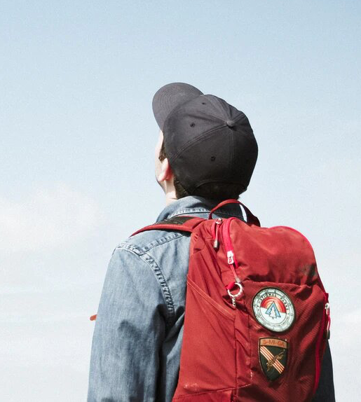

# FILTROS DE IMÁGENES EN OpenCV
## Estudiante
- Larraondo Lamchog, Alejandro Jesús


## Preliminares
- Implementar filtros de imágenes en OpenCV
    - Filtro de Sobel
    - Filtro de Laplace
    - Filtro de bordes de Canny
    - Operaciones morfológicas compuestas
    - Filtros lineales arbitrarios
- Para visualizar todos los resultado ingresar en este link => [Resultados finales](https://github.com/jhuni45/TCG-Laboratorio/tree/master/Practicas/Practica%202/Alejandro/Output)    

## Ejecución
Compilación
```bash
# Creamos el makefile que enlace las librerias
cmake .
# Compilamos el código
make
# Ejecutamos
./pract2 [ ejercicio -s | -l | -a | -c | -m1 | -m2 ] [imagen1] [imagen2 (-m2) ]
```


## Imágenes de entrada 
### Para Sobel, Laplace, Canny, Ajuste local


### Para Suavizado Intermedio


## Pruebas

### 1. Filtro de Sobel

### 2. Filtro de Laplace

### 3. Filtro de bordes de Canny

### 4. Operaciones morfológicas compuestas
- Ajuste o estiramiento local

- Efecto de transición

### 5. Filtros lineales arbitrarios

