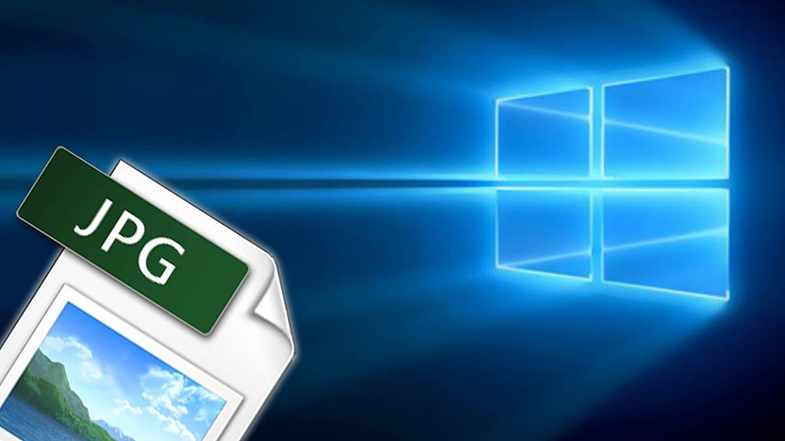
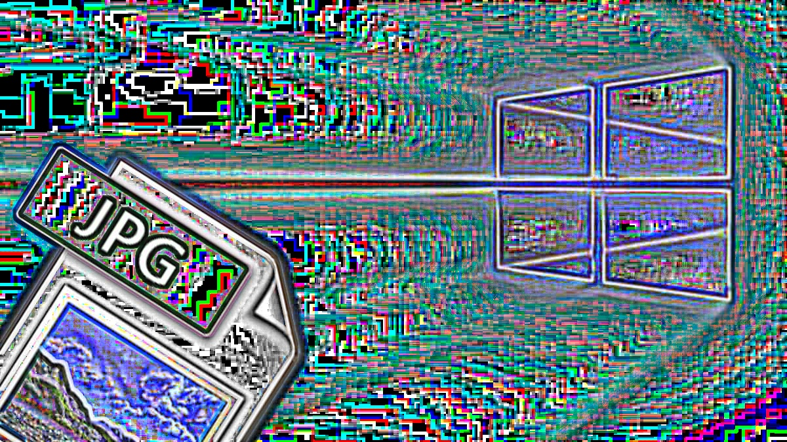

# IMPLEMENTACIÓN DE FILTROS 

## Preliminares
- Implementar en OpenCV las siguientes operaciones con filtros.
  - Sobel
  - Laplace
  - Canny
  - Filtro Ajuste
  - Filtro Suavizado

## Para ejecutar
Compilación
```bash
# Creamos el makefile que linkee las librerias
cmake .
# Compilamos el código
make
```

## Resultados
Resultados en Colab: https://colab.research.google.com/drive/1L_HurfPhWpiBiCafSYkp7Qt0jCUQ0uGX

### 1. Sobel
- El primer y el segundo parametro son las imagenes 
```
!./global_op -g test1.jpg test2.jpg
```

Entrada:
  
  

Salida:
 
 
 
  
### 2. Laplace
Entrada:

  
  
Salida:  
  
  
  
### 3. Canny
Entrada:
  
   
    
Salida:  
   
  
  

### 4. Filtro Ajustado
Entrada:
  


Salida:  
   
  

### 5. Filtro Ajustado
Entrada:
   


Salida:  
   
  errores en la salida 

