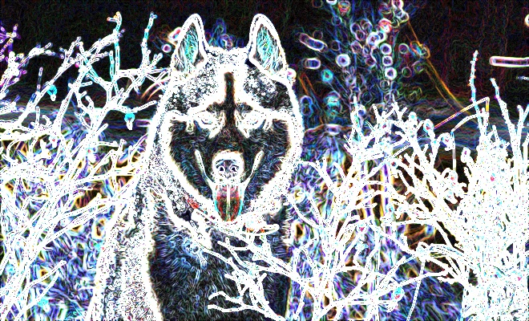

## PROCESAMIENTO GOBLAL EN OpenCV
## Estudiante
- Humpire Cutipa, Hayde Luzmila

## Requerimientos:
- FILTROS LINEALES:
  - Filtro de Sobel
  - Filtro de Laplace
  - Filtro de Bordes de Canny
- FILTROS LINEALES ARBITRARIOS:
  - Máscara de perfilado
  - Máscara de derivada
- FILTROS DE MAXIMO, MINIMO Y MEDIANA:
  - Operaciones de máximo local
  - Operaciones de mínimo local
- OPERACIONES DE MORFOLOGIA:
  - Filtro de Erode
  - Filtro de Dilate
  - Filtro de MorphologyEx
- EJEMPLOS:
  - Aplicar Estiramiento
  - Efecto de Transición

### Google Colab:
Para ver los resultados en Google Colab: https://colab.research.google.com/drive/1lhRgsIcqYrz-YbLsYMGsrPeMnHpKKwud?usp=sharing

## EJERCICIOS

### 1. FILTROS LINEALES:
#### 1.1 Filtro de Sobel

- Entrada: 

- Salida:

### 1.2 Filtro de Laplace

- Entrada: 

- Salida:

### 1.3 Filtro de Bordes de Canny

- Entrada: 

- Salida:

## 2. FILTROS LINEALES ARBITRARIOS:
### 2.1 Máscara de perfilado

- Entrada: 

- Salida:

### 2.2 Máscara de derivada
 

- Entrada: 

- Salida:

## 3. FILTROS DE MAXIMO, MINIMO Y MEDIANA:
### 3.1 Operaciones de máximo y mínimo local

- Entrada: 

- Salida:

## 4. OPERACIONES DE MORFOLOGIA:
### 4.1 Filtro de Erode

- Entrada: 

- Salida:

 local del histograma a la imagen img, con ancho dado. El resultado se almacena en res.

- Entrada: 

- Salida:

### 5.2 Efecto de Transición
Ejemplo 2. Efecto de transición entre dos imágenes (que deben ser de igual tamaño), a través de un suavizado intermedio.

- Entrada: Imagen A

 

- Entrada: Imagen B

- Salida:

