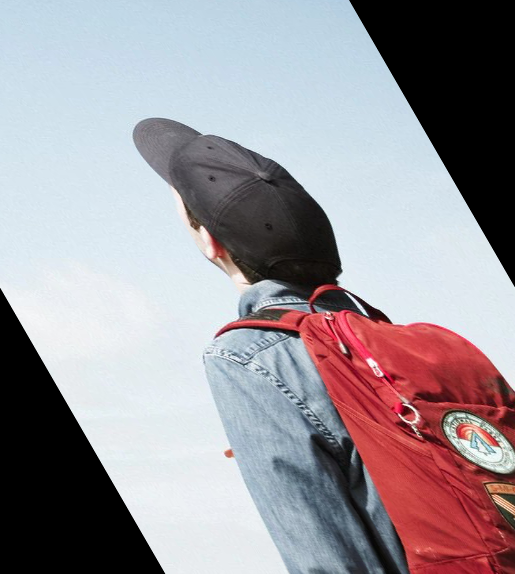

# FILTROS DE IMÁGENES EN OpenCV
## Estudiante
- Larraondo Lamchog, Alejandro Jesús


## Preliminares
- Implementar transformaciones de imágenes en OpenCV
    - Zoom 2x
    - Espejo vertical y horizontal
    - Rotar y escalar
    - Inclinar
    - Transformación afín
- Para visualizar todos los resultado ingresar en este link : [Resultados finales](https://github.com/jhuni45/TCG-Laboratorio/tree/master/Practicas/Practica%203/Alejandro/Output)    

## Ejecución
Compilación
```bash
# Creamos el makefile que enlace las librerias
cmake .
# Compilamos el código
make
# Ejecutamos
./pract3  [-z | -a] [image]
./pract3  [-f | -r | -s] [image] [aux_number]
```


## Imágenes de entrada 


## Pruebas

### 1. Zoom 2x

### 2. Espejo vertical y horizontal
- Flip 2
    
- Flip -2
    
### 3. Rotar y escalar
- Rotation 30°
    
- Rotation 76.5°
    
### 4. Inclinar
- Shear 30°
    
- Shear 76.5°
    
### 5. Transformación afín

