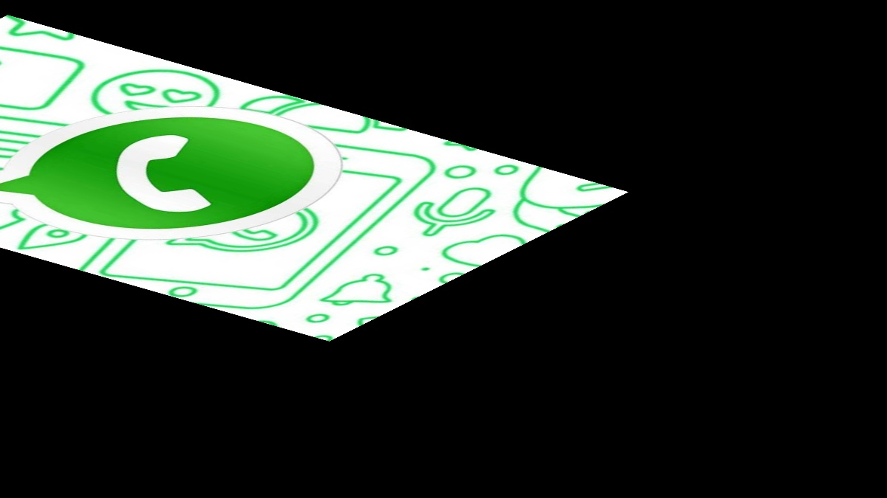

# IMPLEMENTACIÓN DE FILTROS 
La practica se finalizao a las 11:20 y se utilizaron 2 imagenes jpg 
## Preliminares
- Implementar en OpenCV las siguientes operaciones en imagenes.
  - Rezise
  - Flip
  - Rotar
  - Inclinar
  - Transformacion Afin

## Para ejecutar
Compilación
```bash
# Creamos el makefile que linkee las librerias
cmake .
# Compilamos el código
make
```

## Resultados
Resultados en Colab: https://colab.research.google.com/drive 1_5jksUQtr03TNW-qmf5L5cp-4f0zmoBX#scrollTo=NmD3WK1-HxPz

### 1. Rezise
- El primer y el segundo parametro son las imagenes 
```
!./global_op -g test1.jpg test2.jpg
```

Entrada:
  
  

Salida:
 
 
 
  Se puede observar que no parece afectarle el zoom 
### 2. Flip
Entrada:

  
  
Salida:  
  
  
  
La imagen se flipea con exito, el fondo al ser simetrico al momento de fliperse pareciera que solo se flipeo el archivo que dice jpg
### 3. Rotar
Entrada:
  
   
    
Salida:  
   
  

### 4. Inclinar
Entrada:
  
   
    
Salida:  
   
  

### 5. Transformacion Afin
Entrada:
  
   
    
Salida:  
   
  


