## PROCESAMIENTO GOBLAL EN OpenCV
## Estudiante
- Humpire Cutipa, Hayde Luzmila

## Requerimientos:
#### Implementar Transformaciones geométricas en OpenCV::
  - Ejercicio 1: Realizar el zoom 2x de una imagen img (modo in-place).
  - Ejercicio 2: Realizar el espejo vertical y horizontal de una imagen.
  - Ejercicio 3: Rotar y escalar una imagen indicando ángulo y escala.
  - Ejercicio 4: Inclinar (shear) la imagen img en X en angulo grados y desplazar en X para que se quede centrada.
  - Ejercicio 5: Aplicar una transformación afín a una imagen img, suponiendo que tenemos 3 puntos en img y los 3 puntos correspondientes en destino.

### Google Colab:
Hora : 
Para ver los resultados en Google Colab: https://colab.research.google.com/drive/1HfuAALzdsiOR_ojI8LjPCUMEwiIwKgVN?usp=sharing

## EJERCICIOS

### 1. Realizar el zoom 2x de una imagen img (modo in-place).

#### Prueba 1

Entrada: 

Salida:

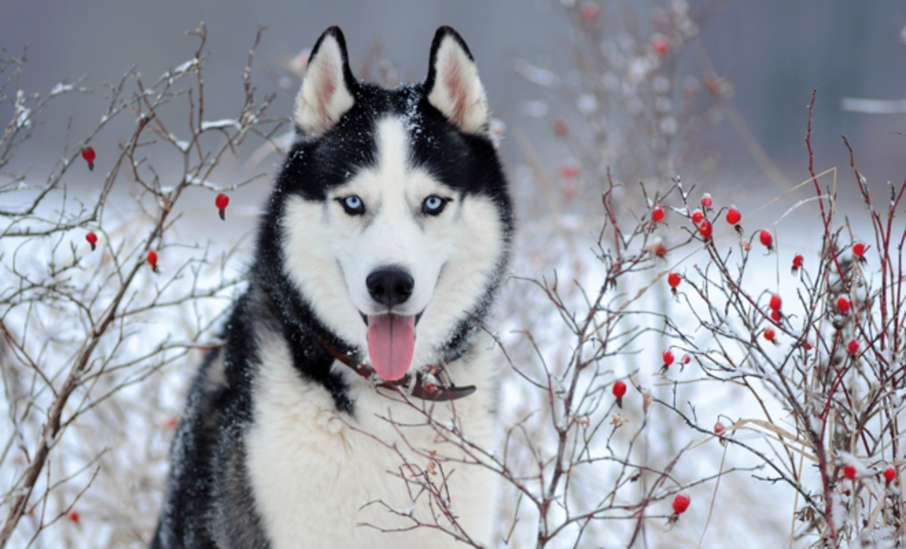

#### Prueba 2

Entrada: 

Salida:

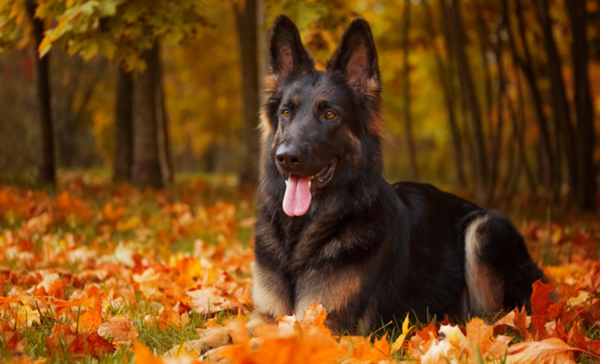

### 2. Realizar el espejo vertical y horizontal de una imagen.

#### Prueba 1

Entrada: 

Salida:1

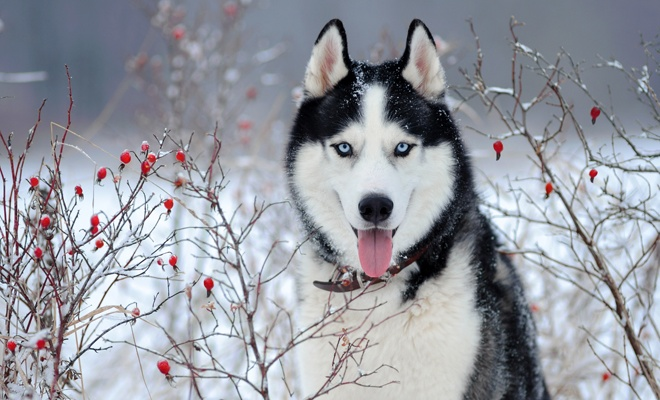

Salida: 0

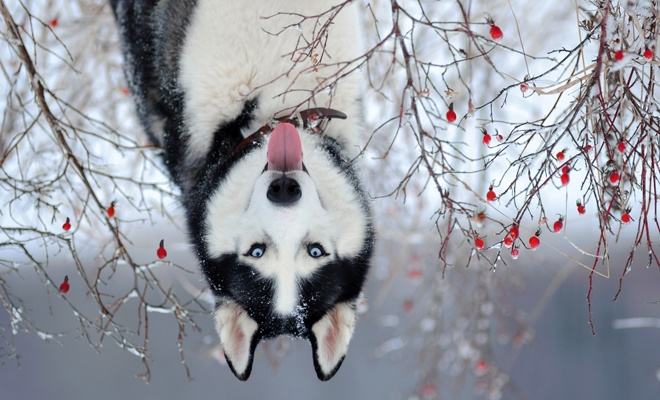

#### Prueba 2

##### Horizontal 

Entrada: 

Salida: 1

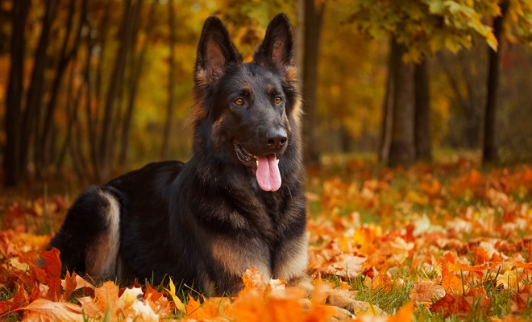

Salida: 0

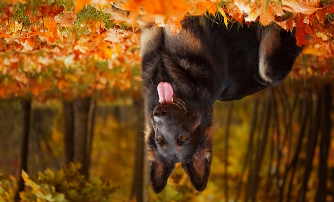

## 3. Rotar y escalar una imagen indicando ángulo y escala.

### Prueba 1

Entrada: 

Salida: 25

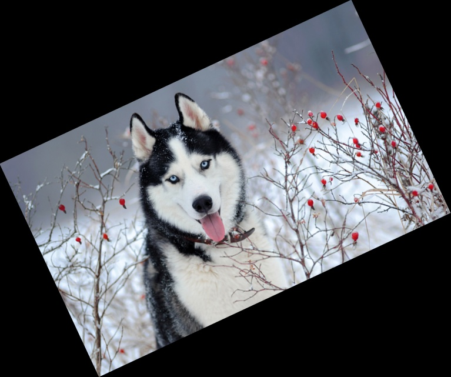

Salida: 50

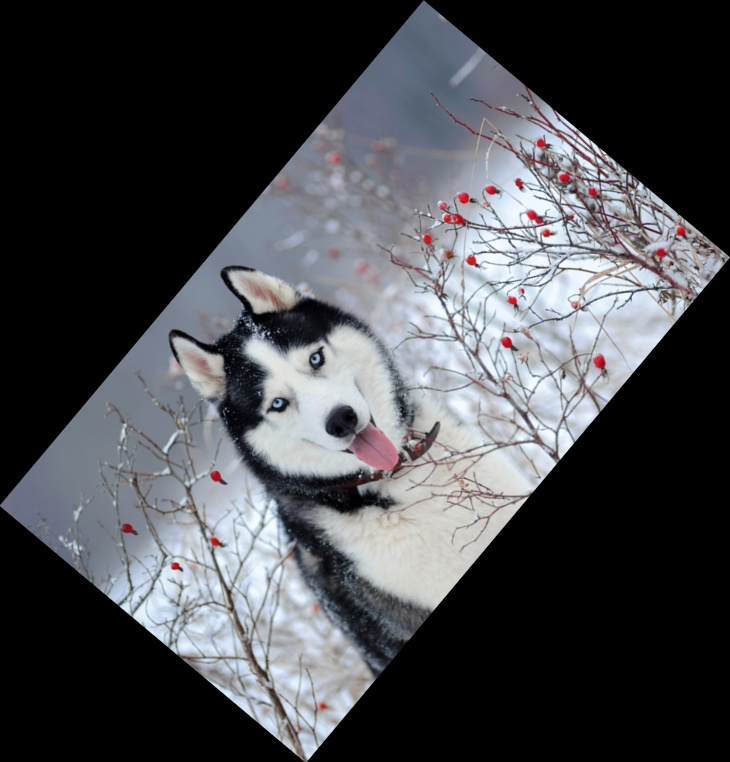

Salida: 100

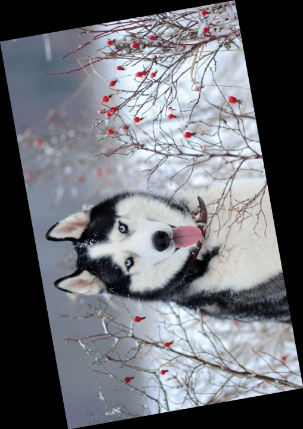

Salida: 125

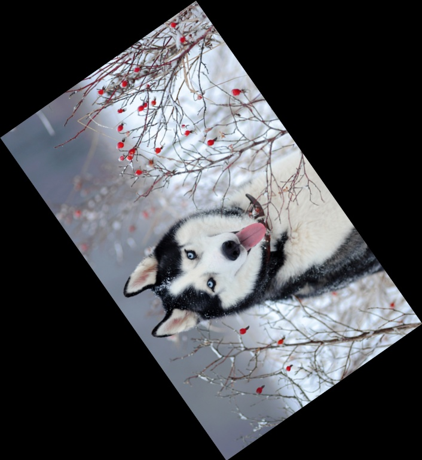

Salida: 150

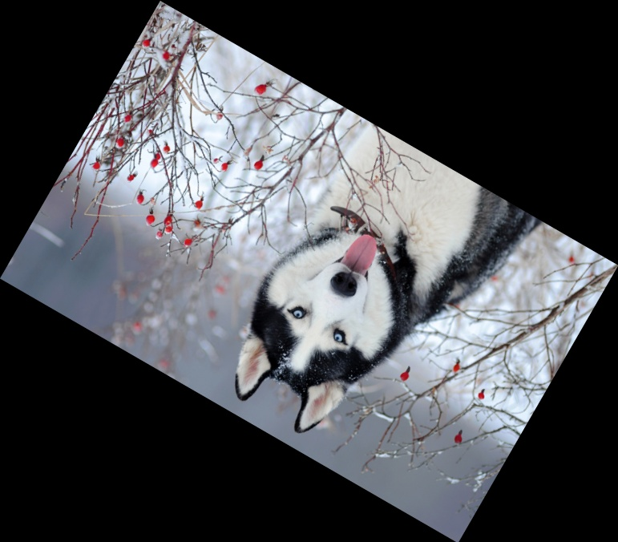

### Prueba 2

Entrada: 

Salida: 25

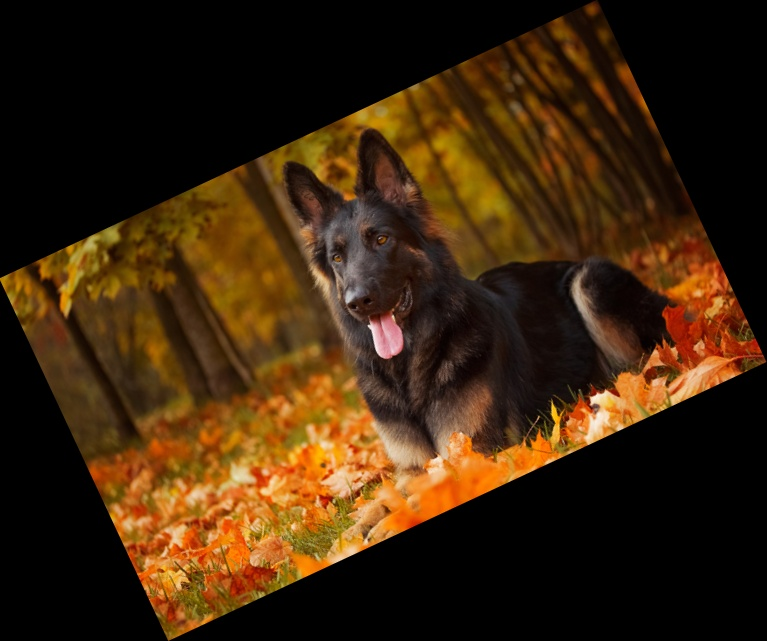

Salida: 50

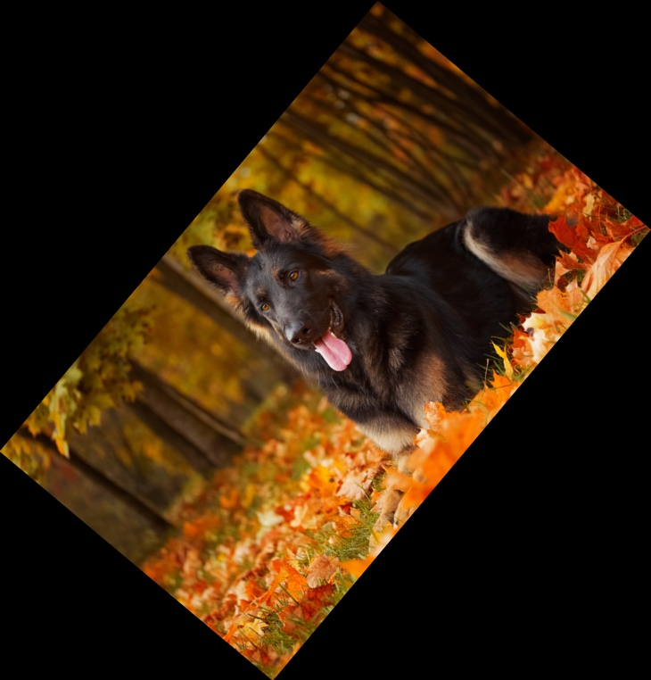

Salida: 100

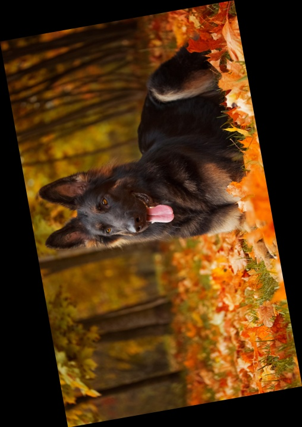

Salida: 125

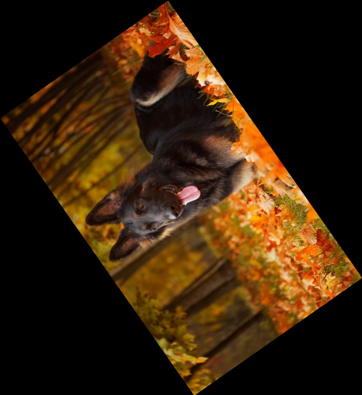

Salida: 150

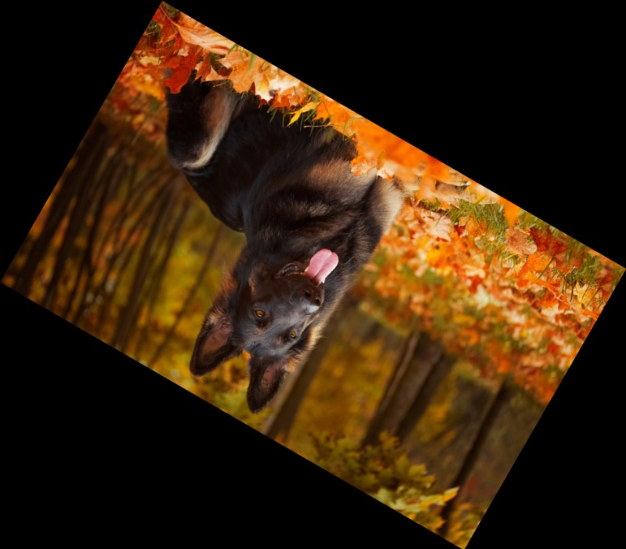

## 4. Inclinar (shear) la imagen img en X en angulo grados y desplazar en X para que se quede centrada.

### Prueba 1

Entrada: 

Salida: 30

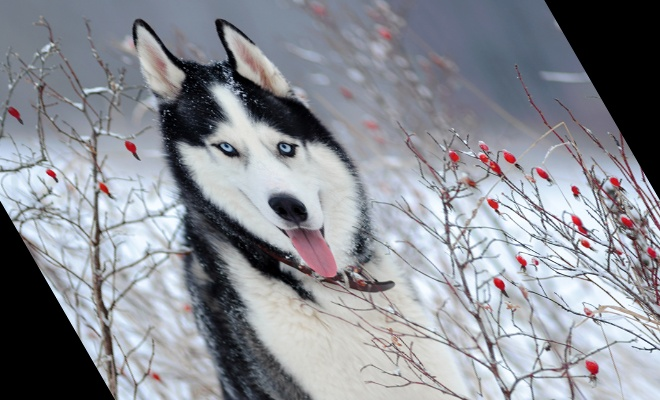

Salida: 60

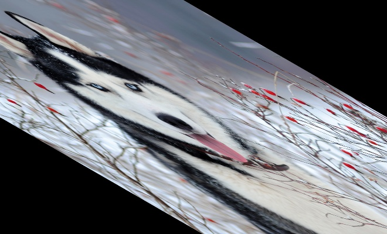

Salida: 90

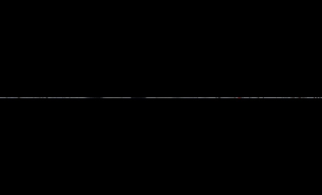

Salida: 100

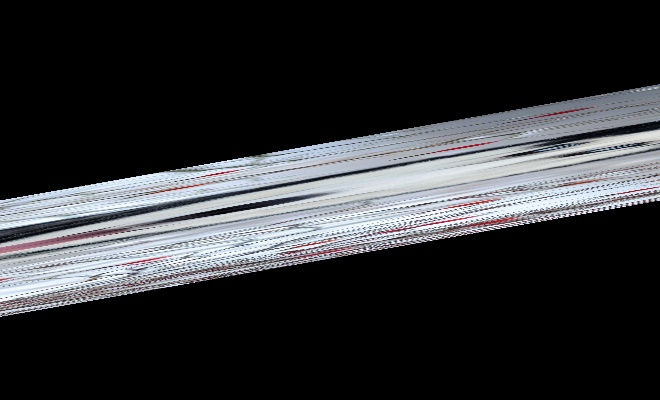

### Prueba 2

Entrada: 

Salida: 30

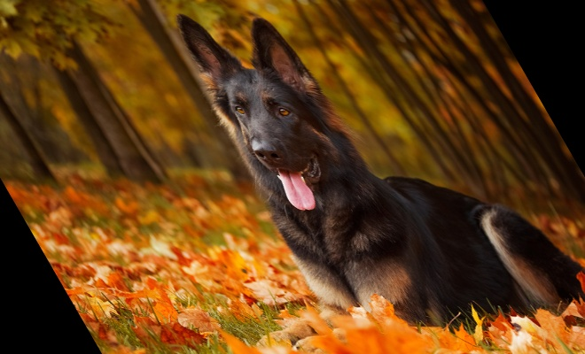

Salida: 60

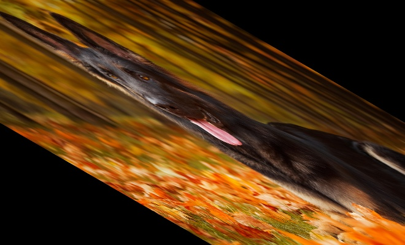

Salida: 90

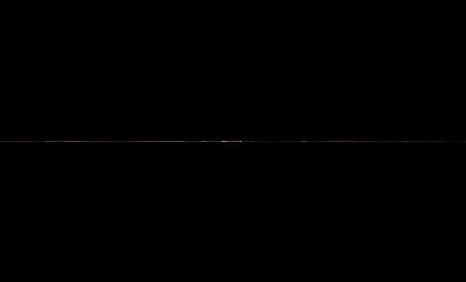

Salida: 100

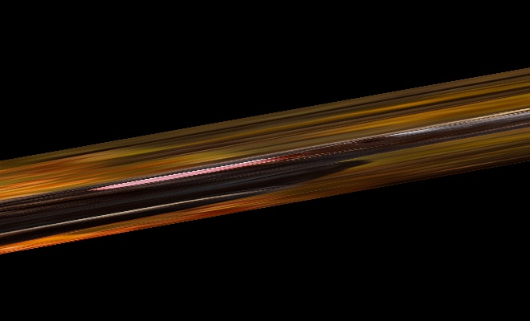

## 4. Aplicar una transformación afín a una imagen img, suponiendo que tenemos 3 puntos en img y los 3 puntos correspondientes en destino.

### Prueba 1

Entrada: 

Salida:

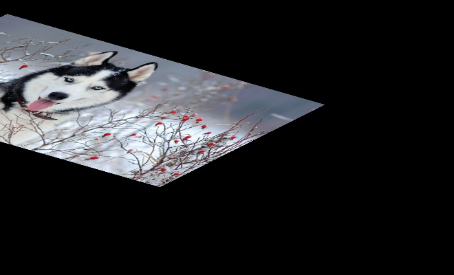

### Prueba 2

Entrada: 

Salida:

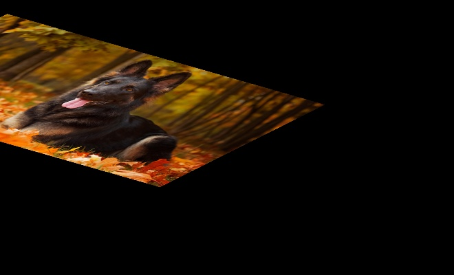
