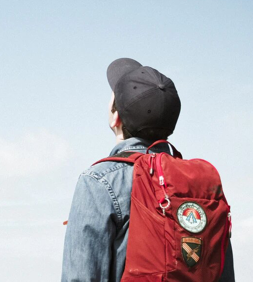
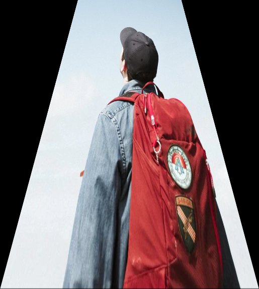
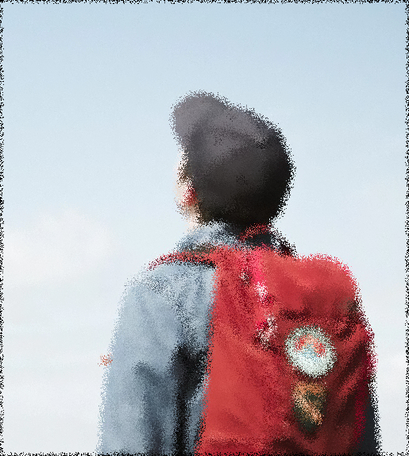
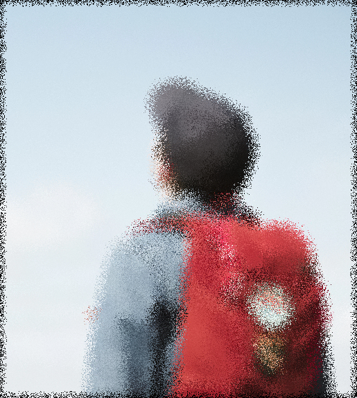
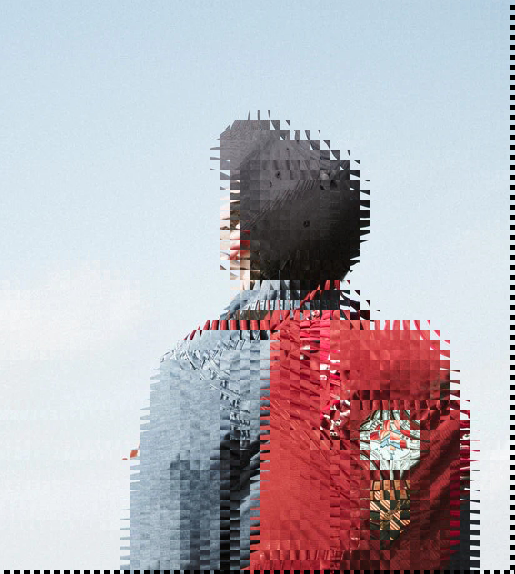

# Transformaciones de Perspectiva y Mapeo en OpenCV
## Estudiante
- Larraondo Lamchog, Alejandro Jesús


## Preliminares
- Implementar transformaciones de imágenes en OpenCV
    - Transformación perspectiva
    - Transformación aleatoria con radio
    - Transformación de acristalado
- Para visualizar todos los resultado ingresar en este link : [Resultados finales](https://github.com/jhuni45/TCG-Laboratorio/tree/master/Practicas/Practica%204/Alejandro/Output)
- Subido a las 11:35 pm del 25 de Junio    

## Ejecución
Compilación
```bash
# Creamos el makefile que enlace las librerias
cmake .
# Compilamos el código
make
# Ejecutamos
./pract4  [-p] [image]
./pract4  [-r | -a] [image] [aux_number]
```


## Imágenes de entrada 


## Pruebas

### 1. Transformación perspectiva

### 2. Transformación aleatoria con radio
- Radio 5

    
- Radio 10

    

### 3. Transformación de acristalado
- Radio 10

    
- Radio 30

    

