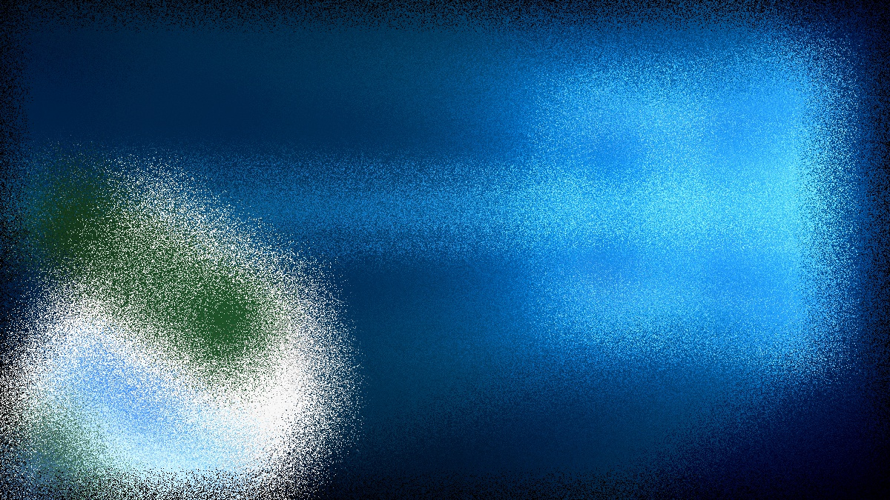

# IMPLEMENTACIÓN DE TRANSFORMACIONES
-La practica se finalizo a las 13:30 del 24/06/2020 y se utilizaron 2 imagenes jpg 

## Preliminares
- Implementar en OpenCV las siguientes operaciones en imagenes.
  - Transformacion perspectiva
  - Transformacion aleatoria de deformacion
  - Transformacion de acristalado

## Para ejecutar
Compilación
```bash
# Creamos el makefile que linkee las librerias
cmake .
# Compilamos el código
make
```

## Resultados
Resultados en Colab: https://colab.research.google.com/drive/1eNtJf1f42CYwOpJ8Fq0xp8mIKeVIRfhj#scrollTo=RGw64YOEghIY
### 1. Transformacion perspectiva
- El primer y el segundo parametro son las imagenes 
```
!./global_op -g test1.jpg test2.jpg
```

Entrada:
  
  

Salida:
 
 
 

### 2. Transformacion aleatoria de deformacion
Entrada:

  
  
Salida:  
  
  
  
### 3. Transformacion de acristalado
Entrada:
  
   
    
Salida:  
   
  


