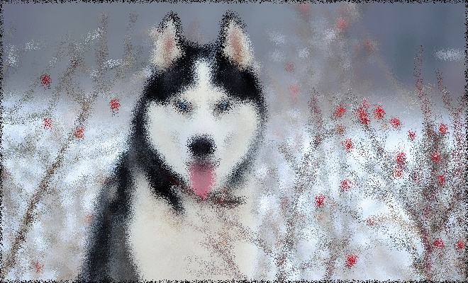
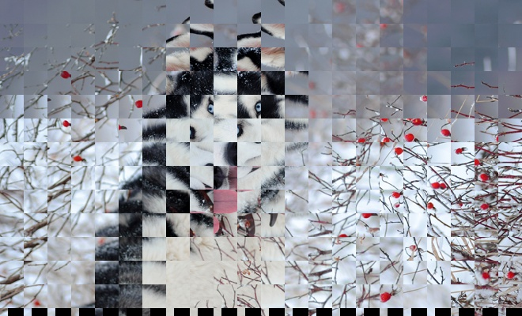
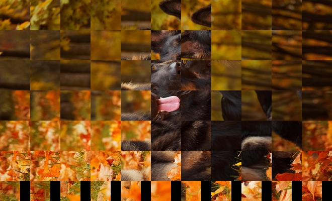

## TRANSFORMACIONES DE PERSPECTIVA Y MAPEO EN OpenCV 

## Estudiante

- Humpire Cutipa, Hayde Luzmila

## Preliminares:

#### Implementar en OpenCV las siguientes operaciones en imagenes.

- Ejercicio 01:
    - Transformacion perspectiva: Transformación perspectiva de una imagen, img, para producir un efecto similar al de la figura.
- Ejercicio 02:
    - Transformacion aleatoria de deformacion: Transformación aleatoria de una imagen img, con un radio de deformación de m.
- Ejercicio 03:
    - Transformacion de acristalado: En el código anterior, sustituir las líneas comentadas poy mapa1 y mapa2.

### Fecha de Presentación:

- Fecha: Miercoles 24 de Junio del 2020
- Hora: 22:15 horas

### Google Colab:

Para ver los resultados en Google Colab: https://colab.research.google.com/drive/1M8nj_hGqYn6t8Zd9f162OTJavzk7y3QN?usp=sharing

## EJERCICIOS

### 1. Transformación perspectiva de una imagen, img, para producir un efecto similar al de la figura.

#### Prueba 1

Entrada: 

Salida:

#### Prueba 2

Entrada: 

Salida:

### 2. Transformación aleatoria de una imagen img, con un radio de deformación de m.

#### Prueba 1

Entrada: 

Salida: 1

Salida: 5

Salida: 20

#### Prueba 2

Entrada: 

Salida: 1

Salida: 5

Salida: 20

### 3. Transformacion de acristalado: En el código anterior, sustituir las líneas comentadas poy mapa1 y mapa2.

#### Prueba 1

Entrada: 

Salida: 30

Salida: 60

Salida: 90

#### Prueba 2

Entrada: 

Salida: 30

Salida: 60

Salida: 90

