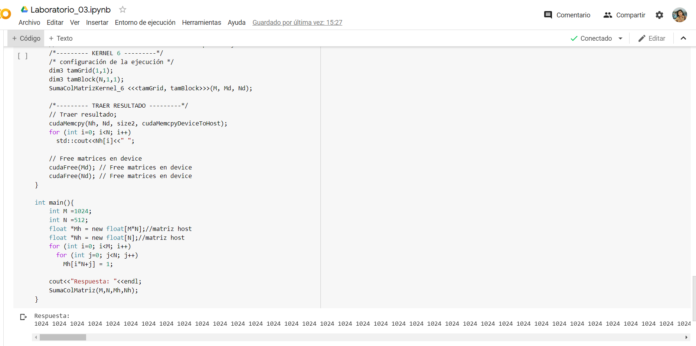

# SUMA DE LOS VALORES DE UNA MATRIZ EN GPU
## Integrantes
- Basurco Cayllahua, Eduardo Rolando
- Chavez Cruz, Jhunior Kenyi
- Humpire Cutipa, Hayde Luzmila
- Larraondo Lamchog, Alejandro Jesús 

## Preliminares
- Programar en GPU la suma de las columnas de una matriz usar memoria compartida y distribución de los hilos de forma bidimensional.
  - Resultado de la suma de los valores de una matriz en GPU.
  
## Requerimientos

### Kernel con Memoria Compartida
- Es cientos de veces más rápida que la memoria global.
- Puede usarse como una especie de caché para reducir los accesos a memoria global.
- Permite que los hilos de un mismo bloque puedan cooperar.
- Dimensión pequeña.
- Se puede usar para evitar accesos no coalesced a la memoria global:
  - Los datos se guardan en forma intermedia en la memoria compartida.
  - Se reordena el acceso a los datos para que cuando se copien de memoria compartida a memoria global el acceso sea coalesced.

### Inicializar el entorno CUDA en Google Colab
Ejecutar un programa Cuda para tarjetas Nvidia via Online con ayuda de una maquina virtual. Si no tienes una pc  con una tarjeta de video Nvidia para realizar programacion paralela, google colab nos brinda una maquina virtual en su plataforma Google Colab.
```codigo
!pip install git+git://github.com/andreinechaev/nvcc4jupyter.git
%load_ext nvcc_plugin

Collecting git+git://github.com/andreinechaev/nvcc4jupyter.git
  Cloning git://github.com/andreinechaev/nvcc4jupyter.git to /tmp/pip-req-build-t7vw7k9c
  Running command git clone -q git://github.com/andreinechaev/nvcc4jupyter.git /tmp/pip-req-build-t7vw7k9c
Requirement already satisfied (use --upgrade to upgrade): NVCCPlugin==0.0.2 from git+git://github.com/andreinechaev/nvcc4jupyter.git in /usr/local/lib/python3.6/dist-packages
Building wheels for collected packages: NVCCPlugin
  Building wheel for NVCCPlugin (setup.py) ... done
  Created wheel for NVCCPlugin: filename=NVCCPlugin-0.0.2-cp36-none-any.whl size=4307 sha256=76363da1b9c47ca3d63e6e815f0bb83f62e8c2c7693ee97faf878def31cce1ba
  Stored in directory: /tmp/pip-ephem-wheel-cache-7dv10ci6/wheels/10/c2/05/ca241da37bff77d60d31a9174f988109c61ba989e4d4650516
Successfully built NVCCPlugin
The nvcc_plugin extension is already loaded. To reload it, use:
  %reload_ext nvcc_plugin
```

## Lanzamiento del kernel 6 memoria compartida y memoria bidimensional
```cuda
// Lanzamiento del kernel 6 con memoria compartida y memoria bidimensional
    /*--------- KERNEL 6 ---------*/
    /* configuración de la ejecución */
    dim3 tamGrid(1,1);
    dim3 tamBlock(N,1,1);
    SumaColMatrizKernel_6 <<<tamGrid, tamBlock>>>(M, Md, Nd);
    
```
### Kernel 6 memoria compartida  y memoria bidimensional
```cuda
// Lanzamiento del kernel 6 con memoria compartida y memoria bidimensional
__global__ void SumaColMatrizKernel_6(int M, float* Md, float* Nd){
    // Pvalue es usado para el valor intermedio
    float Pvalue = 0;
    int columna = threadIdx.x;
    int posIni = columna*M;
    for (int k = 0; k < M; ++k) {
      Pvalue = Pvalue + Md[posIni+k];
    }
    Nd[columna] = Pvalue;
  }
  
```

## Compilación y ejecución de código

### Resultado para matriz de 1024x512
Resultados en Colab: https://colab.research.google.com/drive/1y7XRU1DEryvOLZKcgAQ9HkLEKGQRgjZl?usp=sharing

#### Kernel 6 usando solo memoria compartida y dimensional


## Reduce
- Reducción en paralelo de la suma.
- Los datos se copian inicialmente de la memoria global a la memoria compartida.
- Solamente se realiza la primera etapa de la reducción. 

### Para declarar la memoria compartida se puede usar una constante:
```cuda
#define CANT_HILOS 128
__global__ void reduction(float * output, float * input) {
 __shared__ float intermedio[CANT_HILOS];
 …
};
reduction <<<N_BLOCK,CANT_HILOS>>> (output,input);
```

### Para declarar la memoria compartida se puede hacer en forma dinámica con extern:
```cuda
__global__ void reduction(float * output, float * input) {
 extern __shared__ float intermedio[];
 …
};
reduction <<<N_BLOCK, CANT_HILOS, CANT_HILOS*sizeof(float)>>> (output,input);
```
