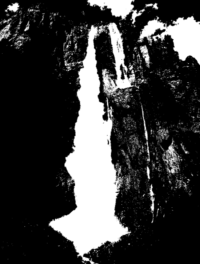
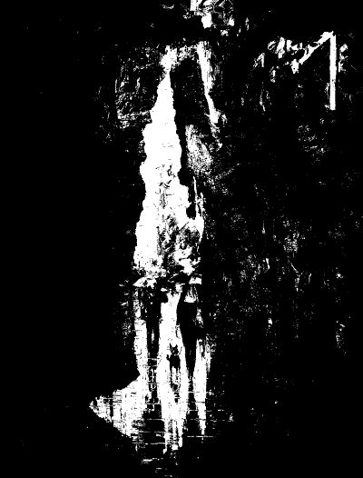
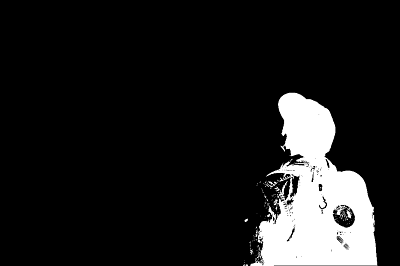

# IMPLEMENTACIÓN EN GPU DE OPERACIONES GLOBALES 
## Integrantes
- Basurco Cayllahua, Eduardo Rolando
- Chavez Cruz, Jhunior Kenyi
- Humpire Cutipa, Hayde Luzmila
- Larraondo Lamchog, Alejandro Jesús 

## Preliminares
- Implementar en GPU las siguientes operaciones Globales.
  - Operador Gama
  - Ecualización de una imagen
  - Una operación aritmética (Ejm: Suma de imágenes)
  - Las operaciones lógicas AND, OR y Negación

## Para ejecutar
Compilación
```bash
# Creamos el makefile que linkee las librerias
cmake .
# Compilamos el código
make
```

#### Binarización (-b)
- El tercer parámetro es un threshold
- Se la convierte en escala de grises
- Se binariza

```
!./global_op -b person.jpg 160
!./global_op -b image.jpg 160
!./global_op -b image2.jpg 160
```

## Resultados
### 1. Operador Gama
Corrección Gamma (-g)
- El tercer parámetro es el valor de gamma
```
!./global_op -g image.jpg 0.5
!./global_op -g image.jpg 3
```

Entrada:
  
  
    
Salida: 0.5
  
  
  
Salida: 3 
   
  

### 2. Ecualización de una imagen
Entrada:
    
Salida:  
 
### 3. Una operación aritmética (Ejm: Suma de imágenes)
Suma media ponderada (-s)
- El cuarto parámetro es el porcentaje
```
!./global_op -s image.jpg image2.jpg 0.5
```

Entrada:
  
   
    
Salida:  
   
  
  
### 4. Las operaciones lógicas AND, OR y Negación
#### 4.1 Operacion lógica AND:
Operador and (-and)
- Ingresa 2 imagenes binarizadas
```
!./global_op -and image.jpg_binary.png image2.jpg_binary.png

```

Entrada:
  
   
  
Salida:
  
  

#### 4.2 Operacion lógica OR:
 Operador or (-or)
 - Ingresa 2 imagenes binarizadas
```
!./global_op -or image.jpg_binary.png image2.jpg_binary.png

```

Entrada:
  
   
    
Salida:
  
  
  
#### 4.3 Operacion lógica Negación:
Operador not (-not)
- Ingresa una imagen binarizada
- Se invierten los elementos
```
!./global_op -not person.jpg_binary.png
```

Entrada:
  
  
    
Salida:
  
  

